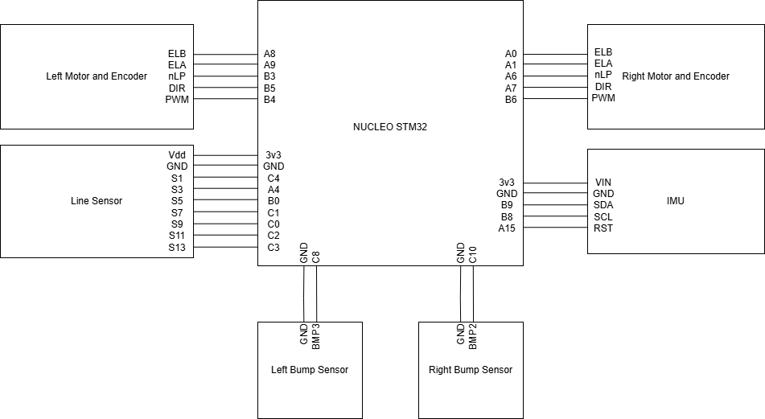

Hardware Diagram
================

Overview
--------

This diagram shows the overall hardware layout of the system, including the microcontroller, 
motor drivers, encoders, bump sensors, line sensor, and IMU. The STM32 microcontroller interfaces 
with the motor driver to control two DC motors. Encoder, IMU data, bump sensor, and line sensor 
feedback is used for closed-loop control. 

Parts
-----
Besides the Romi kit and the provided IMU (BNO055) we used 2 Bump sensor kits with only 1 sensor installed per-side,
as well as the QTRX 7 Sensor 8mm spacing line sensor. Both were purchased from Pololu.