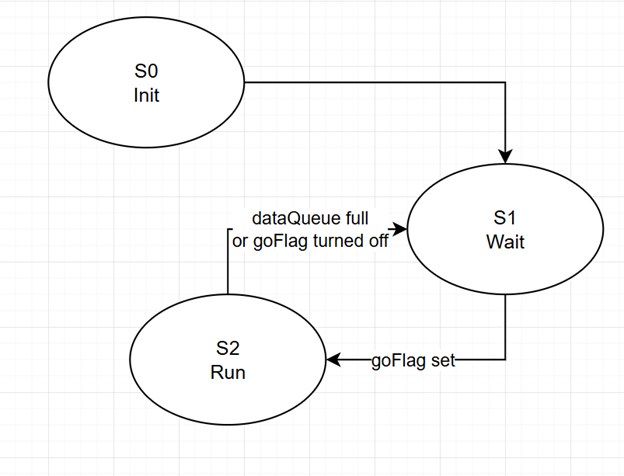
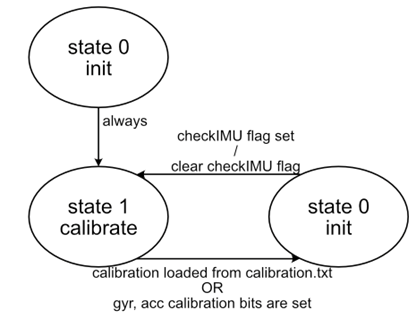
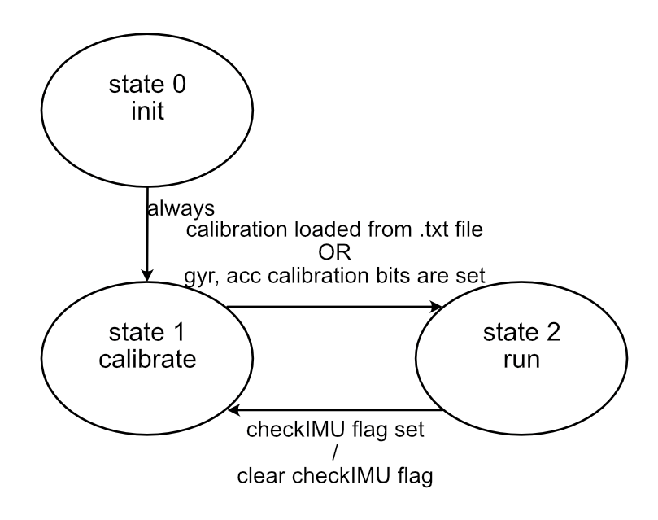
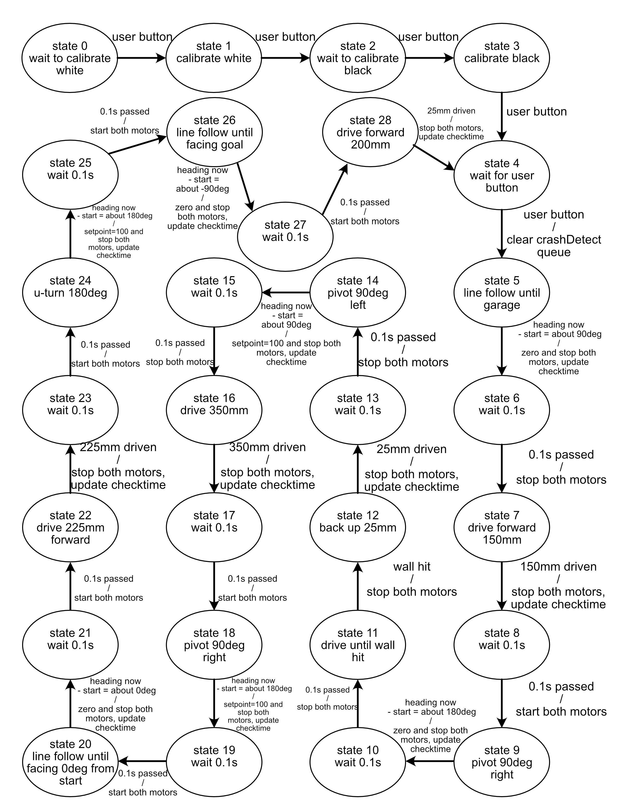

State Diagrams
================

Overview
--------
The state diagrams for each task display the total amount of individual states 
cycled through by each task. Arrows indicate the direction of flow between each 
state, with the text next to each arrow indicating conditions to switch states 
as well as share/queue updates upon changing state. Conditions to switch states 
will always be present on each arrow, with a forward slash separating these conditions and the updated shared values.

Motor
-----
The motor tasks contain only three states each for the left and right motor. 
One state initializes the object, and the other two are cycled between to turn 
the motor on and off. Our team chose to have this task handle motor and encoder 
objects instead of having a discrete task for each since both should realistically 
be updated at the same time in order to provide immediate feedback on Romi's movement.

Estimator and IMU
--------------
The observer task only contains a few states due to the simplicity of what it needs to 
handle, that being the flow of data to and from the IMU but nothing else. The initial 
calibration state allows for either full recalibration, or if a .txt file is present, 
the automatic loading of those values to completely avoid any lengthy calibration steps.

User
----
The user task contains the most states out of all tasks. In hindsight, since many of these 
states were simply wait states, the total amount of states could've been nearly halved if 
we combined the waiting states into some of the other states or made a single state for 
waiting that was repeatedly called back to. Otherwise, it was chosen to have all code that 
handled Romi's desired movement sequence in this task, with the sequence being broken up 
in a way that would ensure each segment of the path was easy to design for.

