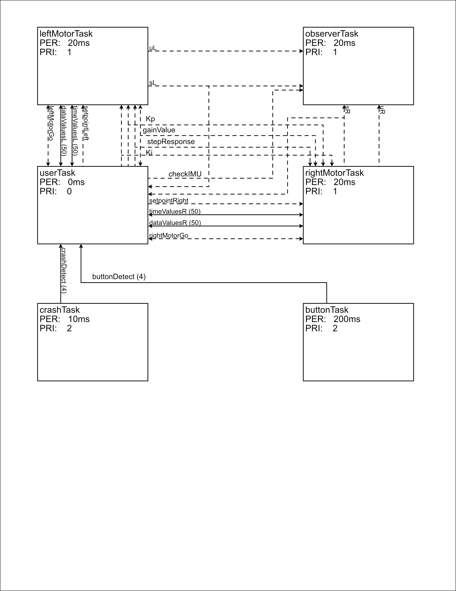

Task Diagrams
================

Overview
--------

The task diagram shows the interaction between each individual task defined in main.py, 
including each task's name, the period at which they run, their priority in the scheduler, 
and the shares and queues interfaced with by each. Shares are indicated by dashed lines, 
while queues are indicated by solid lines. The number next to each queue indicates its length. 
Arrowheads indicate read/write capability for each task.

